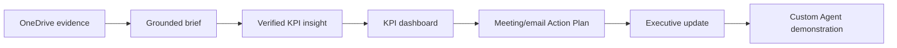

## Today’s journey

Hello, Welcome to the Microsoft 365 Copilot Premium Workshop! My name is Pon, your instructor. Today, you will work with Asteria Insurance, a fictional insurer. Each exercise produces an artifact that the next exercise uses.

 Copilot can move quickly, but you remain the reviewer. Treat every output like a draft from a capable colleague: check the evidence before it enters the next document. <strong>- Pon</strong>

## Timetable

| Time | Learner journey |
|---|---|
| 09:00–10:30 | Ground an executive brief with Copilot Chat, Work IQ, and OneDrive files |
| 10:30–10:45 | Break |
| 10:45–12:00 | Analyze transparently in Excel, inspect changes, and present verified findings in PowerPoint |
| 12:00–13:00 | Lunch |
| 13:00–13:45 | Recap meeting and email in Copilot Chat, generate a Word Action Plan and draft an email |
| 13:45–14:30 | Create a five-slide executive update from the checked Action Plan |
| 14:30–14:45 | Break |
| 14:45–15:15 | Session 5: Custom Agent demonstration |
| 15:15–15:30 | Copilot UI update and orientation |
| 15:30–16:00 | Workplace application reflection, questions and next steps |

## Exercises

  
<h3>1. Ground the brief</h3>
Compare a general answer with an answer grounded in authorized files.
<a href="./exercises/01-ground-the-brief">Start Exercise 1</a>

  
<h3>2. KPI analysis to dashboard</h3>
Explore three insights, create a chart and complaint colours, then present a three-slide dashboard with a quick comparison to Excel.
<a href="./exercises/02-kpi-to-decision-brief">Start Exercise 2</a>

  
<h3>3. Recap to Action Plan</h3>
Recap meeting and email in one Copilot Chat conversation, generate a Word Action Plan and draft a follow-up email.
<a href="./exercises/03-meeting-to-follow-up">Start Exercise 3</a>

  
<h3>4. Action Plan to executive deck</h3>
Create five slides in PowerPoint from your Action Plan, complete the KPI snapshot using your reviewed Excel workbook, and make a quick final check.
<a href="./exercises/04-evidence-to-executive-story">Start Exercise 4</a>

  
<h3>5. Custom Agent demonstration</h3>
Observe a prepared Custom Agent on the instructor’s account.
<a href="./exercises/05-explore-ai-agents">Open Session 5</a>

## What you will finish with

- A grounded evidence brief
- A reviewed KPI workbook and chart
- A three-slide executive KPI dashboard
- A Word Action Plan saved in OneDrive and one unsent email draft in Copilot Chat
- A five-slide executive presentation with the KPI chart, meeting highlights, actions and next steps
- One possible Custom Agent application note

[Prepare your account and download the practice files →](./before-you-begin#prepare-your-files)
