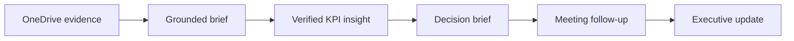

## Today’s journey

You will work with Asteria Insurance, a fictional insurer. Each exercise produces an artifact that the next exercise uses.

<strong>Pon:</strong> Copilot can move quickly, but you remain the reviewer. Treat every output like a draft from a capable colleague: check the evidence before it enters the next document.

## Timetable

| Time | Learner journey |
|---|---|
| 09:00–10:30 | Ground an executive brief with Copilot Chat, Work IQ, and OneDrive files |
| 10:30–10:45 | Break |
| 10:45–12:00 | Find KPI anomalies in Excel and carry verified insights into Word |
| 12:00–13:00 | Lunch |
| 13:00–14:30 | Turn a Teams transcript into decisions and an Outlook follow-up |
| 14:30–14:45 | Break |
| 14:45–16:00 | Turn the evidence pack into a checked PowerPoint executive update |

## Exercises

  
<h3>1. Ground the brief</h3>
Compare a general answer with an answer grounded in authorized files.
<a href="./exercises/01-ground-the-brief">Start Exercise 1</a>

  
<h3>2. KPI to decision brief</h3>
Find anomalies in Excel and transfer only verified evidence into Word.
<a href="./exercises/02-kpi-to-decision-brief">Start Exercise 2</a>

  
<h3>3. Meeting to follow-up</h3>
Extract decisions and owners from a transcript, then prepare an unsent Outlook draft.
<a href="./exercises/03-meeting-to-follow-up">Start Exercise 3</a>

  
<h3>4. Evidence to executive story</h3>
Create a concise PowerPoint update and remove every unsupported claim.
<a href="./exercises/04-evidence-to-executive-story">Start Exercise 4</a>

## What you will finish with

- A grounded evidence brief
- A reviewed KPI workbook and chart
- A one-page leadership decision brief
- An unsent follow-up email or meeting draft
- A concise executive presentation ready for human review

[Prepare your account and download the practice files →](./before-you-begin)
