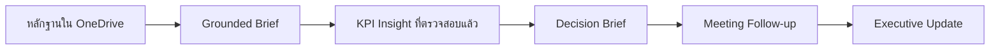

## เส้นทางการเรียนรู้วันนี้

เราจะทำงานกับ Asteria Insurance บริษัทประกันสมมติ แต่ละแบบฝึกหัดจะสร้างผลงานที่นำไปใช้ต่อในแบบฝึกหัดถัดไป

<strong>พล:</strong> Copilot ทำงานได้เร็ว แต่พวกเรายังเป็นคนตรวจรับงาน ลองนึกว่า Copilot คือเพื่อนร่วมงานที่เก่งและช่วยร่างได้ไว เราต้องเช็กหลักฐานก่อนส่งงานนั้นไปยังเอกสารถัดไปนะครับ

## กำหนดการ

| เวลา | เส้นทางการเรียนรู้ |
|---|---|
| 09:00–10:30 | สร้าง Executive Brief จาก Copilot Chat, Work IQ และไฟล์ใน OneDrive |
| 10:30–10:45 | พัก |
| 10:45–12:00 | หา KPI anomaly ใน Excel และนำ insight ที่ตรวจสอบแล้วไปใช้ใน Word |
| 12:00–13:00 | พักกลางวัน |
| 13:00–14:30 | เปลี่ยน Teams transcript ให้เป็น Decision และ Outlook follow-up |
| 14:30–14:45 | พัก |
| 14:45–16:00 | เปลี่ยน Evidence Pack ให้เป็น PowerPoint Executive Update ที่ผ่านการตรวจสอบ |

## แบบฝึกหัด

  
<h3>1. สร้าง Brief จากหลักฐาน</h3>
เปรียบเทียบคำตอบทั่วไปกับคำตอบที่อ้างอิงไฟล์ที่ได้รับอนุญาต
<a href="./exercises/01-ground-the-brief">เริ่มแบบฝึกหัดที่ 1</a>

  
<h3>2. จาก KPI สู่ Decision Brief</h3>
หา anomaly ใน Excel แล้วส่งต่อเฉพาะหลักฐานที่ตรวจสอบแล้วไปยัง Word
<a href="./exercises/02-kpi-to-decision-brief">เริ่มแบบฝึกหัดที่ 2</a>

  
<h3>3. จาก Meeting สู่ Follow-up</h3>
แยก Decision และ Owner จาก transcript ก่อนเตรียม Outlook draft ที่ยังไม่ส่ง
<a href="./exercises/03-meeting-to-follow-up">เริ่มแบบฝึกหัดที่ 3</a>

  
<h3>4. จากหลักฐานสู่ Executive Story</h3>
สร้าง PowerPoint ที่กระชับ และนำทุก claim ที่ไม่มีหลักฐานออก
<a href="./exercises/04-evidence-to-executive-story">เริ่มแบบฝึกหัดที่ 4</a>

## ผลงานเมื่อจบวัน

- Grounded Evidence Brief
- KPI workbook และกราฟที่ผ่านการตรวจสอบ
- Leadership Decision Brief ความยาวหนึ่งหน้า
- Follow-up email หรือ meeting draft ที่ยังไม่ส่ง
- Executive presentation ที่พร้อมให้คนตรวจทานต่อ

[เตรียมบัญชีและดาวน์โหลดไฟล์สำหรับฝึก →](./before-you-begin)
